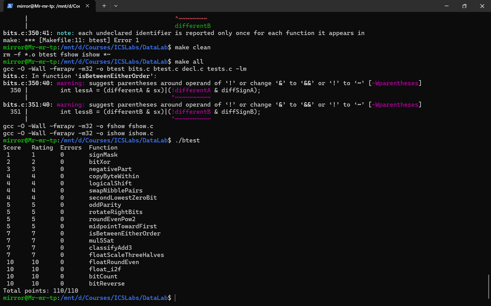

Lab1:DataLab
宓融
25300120001

#1
题目要求输出二进制最高位为1的数，就把1往左移动31位

#2
题目要求实现异或，异或就是(~x&y)|(x&~y)，但是题目不让用|，A|B就是~(~A&~B)，带进去得到答案

#3
判断正负，取符号位就把右移动31位；相反数就取反加一

#4
先把位统一了
'''
int srcShift = src<<3;
int dstShift = dst<<3;
'''
本题分三步
1、取出src上的数 int byte = (x >> srcShift)& 0xFF;
2、把dst上的数清零 int mask = 0xFF << dstShift; int cleared = x & ~mask;
3、把cleared和byte缝合 return cleared|(byte << dstShift);

#5
正的直接 >> n，负的麻烦大，构造掩码把1变成0，那就&上000...1111...，就行了

#6
通过0F0F取数，然后交换位置

#7
从低位找第二个0，0不好找，全部取反，然后通过（y&（y+~0））处理掉第一个1，后保留处理之后第一个1，用rest&(-rest)

#8
只有异或能存奇偶吧，那就要算一下所有位异或，那就往下折叠存，最后所有异或的结果存在最低位，然后取反就行

#9
像第5题那样先变成逻辑右移，然后对n进行取余，就是取最后五位，然后移动一下就行

#10
q是商、r是余数，up是进不进1

#11
x+y不能超，xy比大小判断是否加一

#12
分别判断xa和xb的大小，比较两个判断结果，补充端点情况

#13
把乘法改成加法，再进行溢出检查，最后选择输出limit还是值

#14
除掉4安全运算

#15
拆出浮点字段，将有效数乘以 3 再除以 2，调整指数并按中点取偶数舍入

#16
根据指数确定小数位，清除小数并按中点取偶数舍入，保留零的符号

#17
找到整数绝对值的最高位来确定指数，将有效位对齐并舍入，再拼接浮点编码

#18
用掩码和移位分组统计 1 的数量，再逐层相加得到总数

#19
依次交换相邻的 1、2、4、8、16 位块，实现全部 32 位的反转

